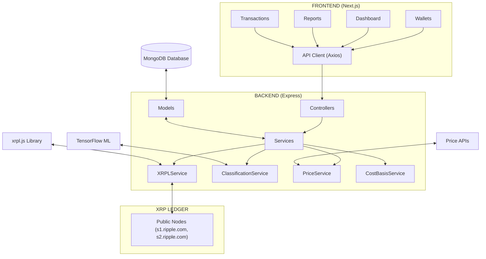

# Plutus: XRPL Tax & Accounting Platform

Plutus is a specialized tax and accounting platform for XRPL users. It automates transaction tracking, tax calculation, and regulatory reporting for individuals and businesses operating on the XRP Ledger. Plutus is designed to provide accurate, audit-ready tax documentation by deeply integrating with XRPL data and supporting multiple accounting methods.

---

## Table of Contents

-   [Features](#features)
-   [Architecture](#architecture)
-   [Code Organization](#code-organization)
-   [XRPL Integration](#xrpl-integration)
-   [Setup & Installation](#setup--installation)
-   [API Overview](#api-overview)
-   [Frontend Overview](#frontend-overview)
-   [Testing](#testing)
-   [Contributing](#contributing)
-   [License](#license)

---

## Features

-   **Automated XRPL Transaction Sync**: Fetches and parses all XRPL transaction types (Payments, DEX trades, TrustSet, Escrow, etc.)
-   **Wallet Management**: Add and track any XRPL wallet address (no private keys required)
-   **Tax Classification**: AI-powered transaction classification and cost basis calculation (FIFO, LIFO, HIFO, Specific ID)
-   **Real-Time Price Data**: Historical and real-time price lookups for accurate gain/loss reporting
-   **Jurisdiction-Specific Reporting**: Generate audit-ready tax reports tailored to user location
-   **Secure Authentication**: JWT-based authentication, password hashing, and role-based access
-   **Modern UI**: Next.js frontend with dashboards, reports, and wallet management

---

## Architecture



---

## Code Organization

### Backend (`backend/`)

-   `src/controllers/` — API endpoint handlers (e.g., `authController.ts`, `reportController.ts`)
-   `src/services/` — Business logic (e.g., `XRPLService.ts`, `ClassificationService.ts`, `PriceService.ts`, `CostBasisService.ts`)
-   `src/models/` — Mongoose models for users, wallets, transactions, tax lots
-   `src/routes/` — Express route definitions
-   `src/middlewares/` — Authentication and other middleware
-   `src/server.ts` — Express app entry point

### Frontend (`frontend/`)

-   `src/app/` — Next.js app directory (routing, layouts, pages)
-   `src/components/` — Reusable UI components
-   `src/hooks/` — Custom React hooks (e.g., `useAuth.ts`)
-   `src/lib/` — API utilities and helpers
-   `src/types/` — TypeScript types

---

## XRPL Integration

-   **Wallet Validation**: Uses `account_info` to validate XRPL addresses
-   **Transaction Sync**: Fetches all transactions using `account_tx` (pagination supported)
-   **Transaction Parsing**: Handles Payments, OfferCreate, TrustSet, Escrow, and more
-   **Classification**: ML-powered classification for tax purposes
-   **Balance Tracking**: Real-time and historical balance lookups
-   **Cost Basis Calculation**: FIFO, LIFO, HIFO, and Specific ID methods
-   **No Private Keys Required**: Only public addresses are needed for tracking

---

## Setup & Installation

### Prerequisites

-   Node.js (v18+ recommended)
-   MongoDB (local or cloud)

### Backend

```bash
cd backend
npm install
cp .env.example .env # Edit with your MongoDB URI and JWT secret
npm run dev
```

### Frontend

```bash
cd frontend
npm install
npm run dev
```

---

## API Overview

-   **Auth**: `/api/auth` — Register, login, change password
-   **Wallets**: `/api/wallets` — Add, list, remove XRPL wallets
-   **Transactions**: `/api/transactions` — Sync and list transactions
-   **Reports**: `/api/reports` — Generate tax reports
-   **Dashboard**: `/api/dashboard` — Summary data for user dashboard

All endpoints require JWT authentication except for registration and login.

---

## Frontend Overview

-   **Login/Register**: Secure authentication flow
-   **Dashboard**: Overview of balances, gains/losses, and recent activity
-   **Wallets**: Add and manage XRPL wallet addresses
-   **Transactions**: View and filter all synced transactions
-   **Reports**: Generate and download tax reports
-   **Settings**: User profile and preferences

---

## Testing

### Backend

```bash
cd backend
npm run test
```

### Frontend

```bash
cd frontend
npm run test
```

---

## Contributing

1. Fork the repository
2. Create a new branch (`git checkout -b feature/your-feature`)
3. Commit your changes
4. Push to your branch and open a pull request

---

## License

This project is licensed under the MIT License.
